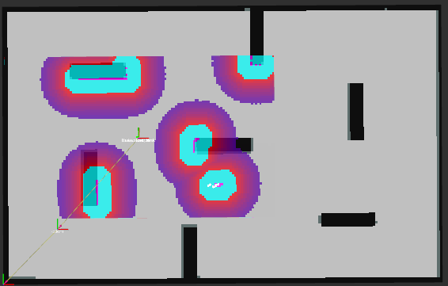
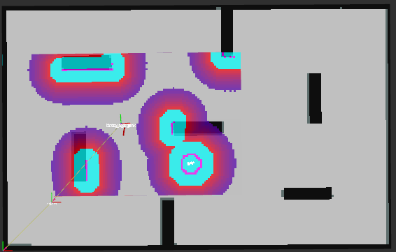
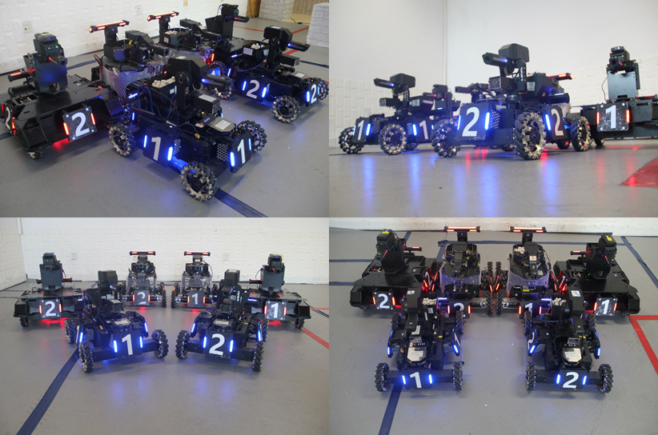
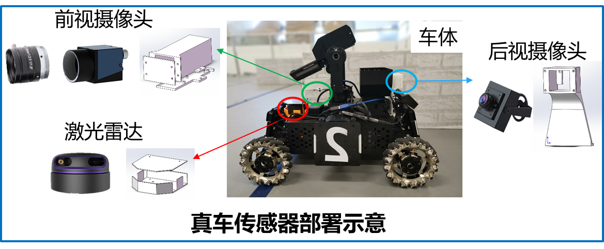
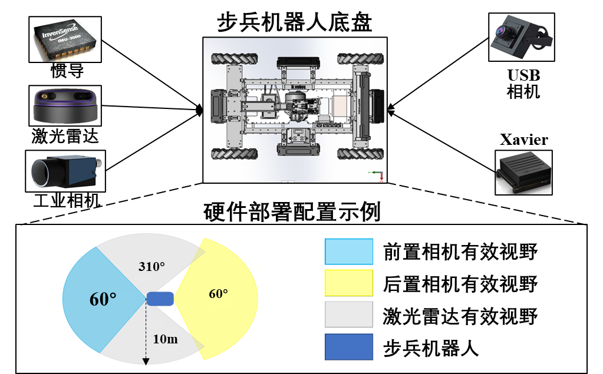
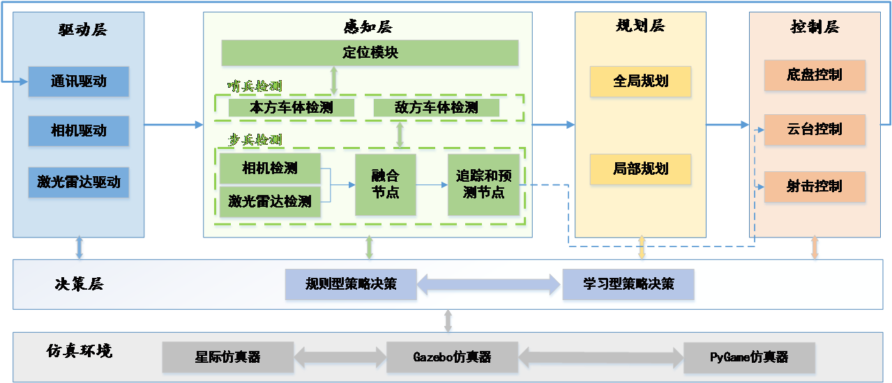
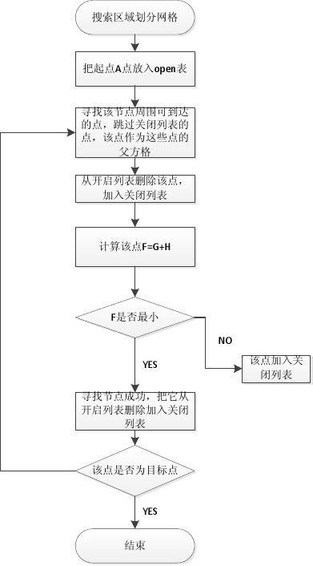
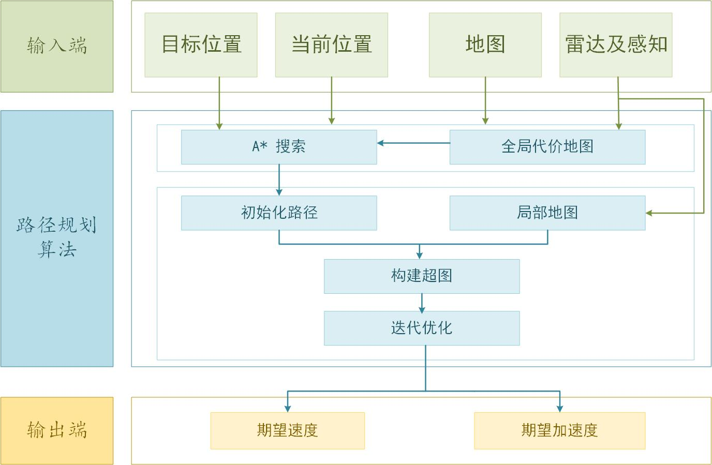

<!-- PROJECT SHIELDS -->

[![Contributors][contributors-shield]][contributors-url]
[![Forks][forks-shield]][forks-url]
[![Stargazers][stars-shield]][stars-url]
[![Issues][issues-shield]][issues-url]
[![MIT License][license-shield]][license-url]
[![LinkedIn][linkedin-shield]][linkedin-url]

<!-- PROJECT LOGO -->
<br />

<p align="center">
  <a href="https://github.com/DRL-CASIA/Planning/">
    
  </a>

  <h3 align="center">中国科学院自动化研究所--Team Neurons</h3>
  <p align="center">
    Time to start！
    <!-- <br />
    <a href="https://github.com/DRL-CASIA/Planning"><strong>Wiki</strong></a>
    <br /> -->
    <br />
    <a href="https://github.com/DRL-CASIA/Planning">查看Demo</a>
    ·
    <a href="https://github.com/DRL-CASIA/Planning/issues">报告Bug</a>
    ·
    <a href="https://github.com/DRL-CASIA/Planning/issues">提出新特性</a>
  </p>

</p>

## 相关工作及成果

[所内报道：深度强化学习团队提出基于深度强化学习的未知环境自主探索方法](http://www.ia.ac.cn/xwzx/kydt/202007/t20200728_5646953.html)

[公众号报道：团队新作 | 基于深度强化学习的未知环境自主探索方法](https://mp.weixin.qq.com/s/E68P5j2chxgenZOiCd0v6g)

发表文献：

 H. Li, Q. Zhang, and D. Zhao. “ Deep reinforcement learning-based automatic exploration for navigation in unknown environment,” IEEE Transactions on Neural Networks and Learning Systems, vol. 31, no. 6, pp. 2064–2076, 2020.  

# 规划模块 

## 目录

- [功能介绍](#功能介绍)
- [效果展示](#效果展示)
- [依赖工具及环境](#依赖工具及环境)
- [编译及安装方式](#编译及安装方式)
- [文件目录结构及文件用途说明](#文件目录结构及文件用途说明)
- [软硬件系统介绍](#软硬件系统介绍)
  - [硬件系统](#硬件系统)
  - [软件系统](#软件系统)
- [原理介绍与理论支持分析](#原理介绍与理论支持分析)
  - [全局规划层](#全局规划层)
  - [局部规划层](#局部规划层)
- [软件架构与层级图](#软件架构与层级图)
- [开源协议](#开源协议)

### **功能介绍**

路径规划层主要控制RoboMaster的移动模块，负责将机器人的决策指令解析成当前环境可行的移动控制指令，并发送给串口模块，由串口模块发送给底层。路径规划层主要由两部分构成，全局规划层和局部规划层。全局规划层是根据上层决策指令和预先建立的环境地图，搜索可行的行驶路径。局部规划层是根据传感器实时反馈数据，将全局路径解算成可行的轨迹。

- 窄道通行

  在过窄道的时候，由于雷达感知的动态障碍物轮廓比实际小，本方战车容易与周围战车发生碰撞。针对此问题我们的解决方案是在costmap中添加动态障碍物层。一般一张costmap是由静态层、障碍物层、膨胀层叠加而来，我们在膨胀层之前加入动态障碍物层，对动态障碍物的轮廓大小进行修正。

  <p align="center">
  <a>
    
  </a >
  <h3 align="center">costmap添加层示意</h3>  
  </p >

  首先，感知算法会对雷达扫描到的点云进行处理，将属于动态障碍物的点云分割出来；我们对分割出的点云进行聚类，从中识别出动态障碍物的个数；然后求取聚类中心，近似得到各个动态障碍物的中心点；再在中心点附近按照动态障碍物的实际轮廓添加模拟点云，最后根据模拟点云形成动态障碍物层并加入costmap中。加入动态障碍物层之后，动态障碍物在costmap中所占的轮廓比之前更大，更接近真实战车大小，这样可以避免过窄道时与周围战车碰撞。

- 巡航

  为了提高战车行动效率，我们允许战车在行进过程中倒行。在战车未配置后置传感器时，局部规划考虑不到后方障碍物的存在，易与后方障碍物发生碰撞。对于后方的静态障碍物，可以通过costmap中的静态层弥补对后方静态障碍物的感知，但如果只在局部规划costmap中加入静态层，会与前方雷达检测形成的障碍物层重合，如果定位有所偏差，容易导致无法窄道通行。

  针对此问题，我们的方法是在costmap中加入局部静态层。方法流程是先读取静态地图，针对战车后方雷达扫描不到的部分，查询机器人当前位姿，提取静态地图中该部分叠加到costmap中。加入局部静态层之后会大大减少战车与后方静态障碍物的碰撞，注意此处我们只对雷达感知不到的部分添加局部静态层，同时避免了因与前方雷达检测形成的障碍物层重合而导致的无法窄道通行。

- 动态避障

  局部静态层可以解决战车未配置后方传感器时对后方静态障碍物的避让，对于后方动态障碍物依然无法避让。另外，即使战车配备了后置传感器，对于友方以及敌方位置的提前感知也有助于规划更优的路径。我们对友方及敌方的规避在规划部分算法的处理是类似的，首先通过通信或哨兵的感知获得友方和敌方的位置，然后查询本方的位姿，当友方或敌方在本方后面时将其加入costmap中。这样，即使对于一个未配置后方传感器的战车，算法依然可以对后方障碍物规划避让。

### **效果展示**
仿真展示——stage + rviz 
  <p align="center">
  <a>
    
  </a >
  <h3 align="center">simulation</h3>  
  </p >

实车展示

  窄道通行——动态障碍物层

  

  <p align="center">
  <a>
    
    
    
    
  </a >
  <h3 align="center">加入动态障碍物层前后对比</h3>  
  </p >

  <p align="center">
  <a>
    
  </a >
  <h3 align="center">窄道通行</h3>  
  </p >

  巡航——加入局部静态层对比

  <p align="center">
  <a>
    
    
  </a >
  <h3 align="center">未加入局部静态层</h3>  
  </p >


  <p align="center">
  <a>
    
    
  </a >
  <h3 align="center">加入局部静态层</h3>  
  </p >


  <p align="center">
  <a>
    
  </a >
  <h3 align="center">“8”字巡航</h3>  
  </p >

  动态避障——单次避障、连续避障

  <p align="center">
  <a>
    

  </a >
  <h3 align="center">动态避障演示1</h3>  
  </p >

  <p align="center">
  <a>
    
  </a >
  <h3 align="center">动态避障演示2</h3>  
  </p >


### **依赖工具及环境**
1. NVIDIA JETSON XAVIER计算平台
2. Ubuntu 18.04
3. Ros melodic平台
4. 安装ROS所需第三方依赖包，以及‘SuitSparse’，‘Glog’，‘protbuf’等其他依赖。
```bash
sudo apt-get install -y ros-melodic-cv-bridge                         \
						ros-melodic-image-transport        \
						ros-melodic-stage-ros                       \
						ros-melodic-map-server                  \
						ros-melodic-laser-geometry          \
						ros-melodic-interactive-markers \
						ros-melodic-tf                                       \
						ros-melodic-pcl-*                                \
						ros-melodic-libg2o                             \
						ros-melodic-rplidar-ros                    \
						ros-melodic-rviz                                  \
						protobuf-compiler                              \
						libprotobuf-dev                                   \ 
						libsuitesparse-dev                              \
						libgoogle-glog-dev                             \
```
其它软件
- cmake
- vim
- terminator
- htop

### **编译及安装方式**
```bash
# 新建工作空间
mkdir -p robo_ws/src
# 切换至src目录
cd robo_ws/src
# 下载RoboRTS源码
git clone https://github.com/DRL-CASIA/Planning.git
# 编译源码
cd ..
catkin_make 
# 加载环境变量
source devel/setup.bash
# 运行
roslaunch roborts_bringup roborts_stage.launch
rosrun roborts_decision sel_behavior_node

```

### **文件目录结构及文件用途说明**

```
filetree
├── roborts_costmap
│   ├── CMakeLists.txt
│   ├── cmake_module
│   ├── config  # 决策、规划中costmap配置以及costmap各层参数设置
│   │   ├── costmap_parameter_config_for_decision.prototxt
│   │   ├── costmap_parameter_config_for_global_plan.prototxt
│   │   ├── costmap_parameter_config_for_global_plan.prototxt.bk1
│   │   ├── costmap_parameter_config_for_local_plan.prototxt
│   │   ├── detection_layer_config.prototxt  # 检测层参数设置
│   │   ├── dynamic_obstacle_layer_config.prototxt  # 动态障碍物层参数设置
│   │   ├── friend_layer_config.prototxt  # 友方层参数设置
│   │   ├── inflation_layer_config_min.prototxt
│   │   ├── inflation_layer_config.prototxt
│   │   ├── local_static_layer_config.prototxt  # 局部静态层参数设置
│   │   ├── obstacle_layer_config.prototxt
│   │   └── static_layer_config.prototxt
│   ├── include
│   │   └── costmap
│   ├── package.xml
│   ├── proto
│   └── src
│       ├── costmap_2d.cpp
│       ├── costmap_interface.cpp
│       ├── costmap_layer.cpp
│       ├── costmap_math.cpp
│       ├── detection_layer.cpp  # 检测层
│       ├── dynamic_obstacle_layer.cpp  # 动态障碍物层
│       ├── footprint.cpp
│       ├── friend_layer.cpp  # 友方层
│       ├── inflation_layer.cpp
│       ├── layer.cpp
│       ├── layered_costmap.cpp
│       ├── local_static_layer.cpp  # 局部静态层
│       ├── observation_buffer.cpp
│       ├── obstacle_layer.cpp
│       ├── static_layer.cpp
│       └── test_costmap.cpp
└── roborts_planning
    ├── CMakeLists.txt
    ├── cmake_module
    ├── global_planner  # 全局规划
    │   ├── a_star_planner  # 全局规划算法
    │   ├── CMakeLists.txt
    │   ├── config
    │   ├── global_planner_algorithms.h
    │   ├── global_planner_base.h
    │   ├── global_planner_node.cpp
    │   ├── global_planner_node.h
    │   ├── global_planner_test.cpp
    │   └── proto
    ├── local_planner  # 局部规划
    │   ├── CMakeLists.txt
    │   ├── config
    │   ├── include
    │   ├── README.md
    │   ├── src
    │   └── timed_elastic_band # 局部规划算法
    └── package.xml
```


### **软硬件系统介绍**
<p align="center">
  <a>
    
  </a >
  <!-- <h3 align="center">实车展示</h3>   -->
</p >
上图展示了我们从2018年到2020年连续三届参加RoboMaster AI挑战赛的步兵机器人。

#### 硬件系统

机器人硬件系统主要由机器人机械主体、外围传感器、计算平台等组成。

机器人主体分为两部分：底盘和云台。底盘是由一个底板和四个电机组成，主要负责机器人的移动；云台主要由发射机构，两个云台电机，弹仓和拨盘电机构成，主要负责发射子弹及信息获取等。

外围传感器主要包括工业相机，激光雷达和后置USB广角相机，可以实现机器人的定位，检测和自主移动等功能。工业相机型号为大恒工业相机MER-U3-L系列，依据相机接口和靶面尺寸配备相机镜头。激光雷达选用思岚RPLIDAR-A3短距离单线激光雷达。

移动计算平台作为自主机器人的计算核心器件，承担着所有软件算法的运行执行任务，选用 NVIDIA Jetson Xavier作为移动计算终端,搭载在步兵机器人内部,并将其部署在云台后方。

<p align="center">
  <a>
    
  </a >
  <h3 align="center">真车传感器部署示意</h3>  
</p >

<p align="center">
  <a>
    
  </a >
  <h3 align="center">硬件部署配置示例</h3>  
</p >

#### 软件系统

机器人软件系统是部署在机器人计算平台上的上层算法程序。该系统通过解析传感器数据和底层反馈的数据,自动地做出相应的决策,并向嵌入式系统发送控制指令。为了解析传感器数据,并根据当前环境和自身状态正确的做出决策,我们构建了如下的软件系统。

<p align="center">
  <a>
    
  </a >
  <h3 align="center">软件系统框图</h3>  
</p >

### **原理介绍与理论支持分析**

#### 全局规划层
全局路径规划需要掌握所有的环境信息，根据环境地图的所有信息进行路径规划，其属于静态规划；A*（A-Star)算法是一种静态路网中求解最短路径最有效的直接搜索方法之一，也是解决许多搜索问题的有效算法。算法中的距离估算值与实际值越接近，最终搜索速度越快。我们在 A* 算法的基础上引入启发式信息-切比雪夫距离替换马氏距离,显著改善 A*算法的路径规划性能,效果如下：

<p align="center">
  <a>
    
  </a >
  <h3 align="center">切比雪夫距离</h3>  
</p >
原理及算法流程

<p align="center">
  <a>
    
  </a >
  <h3 align="center">A*算法流程图(https://wenku.baidu.com/view/8f7a72f371fe910ef12df881.html)</h3>  
</p >

在路径规划初始阶段,机器人系统会通过激光雷达获取场上障碍物分布信息,确定附近是否存在敌方车体。然后根据场上现有信息,全局规划器制定有效移动路径,并将路径信号下传给局部路径规划器。考虑到机器人的移动速率和实际表现情况,将全局规划器更新频率设定为5Hz,为局部路径规划器更新频率的一半,使得路径移动较为平滑。

#### 局部规划层
局部路径规划对环境信息完全未知或有部分可知，侧重于考虑机器人当前的局部环境信息，让机器人具有良好的避障能力，通过传感器对机器人的工作环境进行探测，以获取障碍物的位置和几何性质等信息。这种规划需要搜集环境数据，并且对该环境模型的动态更新能够随时进行校正，将对环境的建模与搜索融为一体。局部规划算法要求机器人系统具有高速的信息处理能力和计算能力，对环境误差和噪声有较高的鲁棒性，能对规划结果进行实时反馈和校正，可以根据全局规划生成路径以及激光雷达扫到的局部环境信息，重新规划可行轨迹，该轨迹包含机器人的期望运动速度。

Timed Elastic Band算法能直接找到更接近于最优解的移动路径，具有更高的计算效率，能够一次性处理多个路径拓扑结构，因此我们选择TEB算法作为局部规划器。

TEB 算法在多条件约束(路径点、障碍物、移速、加速、运动学和最短路径)下构建超图模型,并使用 g2o 中的大规模稀疏矩阵优化算法作优化处理,最终得到移动期望速度和加速度。局部规划器控制车体到达指定目标点后的位置精度误差反映了路径规划器的规划效率。

<p align="center">
  <a>
    
  </a >
  <h3 align="center">利用g2o求解TEB过程</h3> 
  <h3 align="center">*图片来源：Rösmann C, Feiten W, Wösch T, et al. Trajectory modification considering dynamic constraints of autonomous robots[C]//ROBOTIK 2012; 7th German Conference on Robotics. VDE, 2012: 1-6.</h3> 
</p >

### **软件架构与层级图**
路径规划层主要由两部分构成，全局规划层和局部规划层。全局规划层是根据上层决策指令和预先建立的环境地图，搜索可行的行驶路径。局部规划层是根据传感器实时反馈数据，将全局路径解算成可行的轨迹。路径规划算法流程图如下所示。

<p align="center">
  <a>
    
  </a >
  <h3 align="center">路径规划算法流程图</h3>  
</p >


### **开源协议**

该项目签署了MIT 授权许可，详情请参阅 [LICENSE.txt](https://github.com/DRL-CASIA/Planning/blob/master/LICENSE.txt)

<!-- - [GitHub Emoji Cheat Sheet](https://www.webpagefx.com/tools/emoji-cheat-sheet)
- [Img Shields](https://shields.io)
- [Choose an Open Source License](https://choosealicense.com)
- [GitHub Pages](https://pages.github.com)
- [Animate.css](https://daneden.github.io/animate.css)
- [xxxxxxxxxxxxxx](https://connoratherton.com/loaders) -->

<!-- links -->
[your-project-path]:DRL-CASIA/Planning
[contributors-shield]: https://img.shields.io/github/contributors/DRL-CASIA/Planning.svg?style=flat-square
[contributors-url]: https://github.com/DRL-CASIA/Planning/graphs/contributors
[forks-shield]: https://img.shields.io/github/forks/DRL-CASIA/Planning.svg?style=flat-square
[forks-url]: https://github.com/DRL-CASIA/Planning/network/members
[stars-shield]: https://img.shields.io/github/stars/DRL-CASIA/Planning.svg?style=flat-square
[stars-url]: https://github.com/DRL-CASIA/Planning/stargazers
[issues-shield]: https://img.shields.io/github/issues/DRL-CASIA/Planning.svg?style=flat-square
[issues-url]: https://img.shields.io/github/issues/DRL-CASIA/Planning.svg
[license-shield]: https://img.shields.io/github/license/DRL-CASIA/Planning.svg?style=flat-square
[license-url]: https://github.com/DRL-CASIA/Planning/blob/master/LICENSE
[linkedin-shield]: https://img.shields.io/badge/-LinkedIn-black.svg?style=flat-square&logo=linkedin&colorB=555
[linkedin-url]: https://linkedin.com/in/zhentaotang


