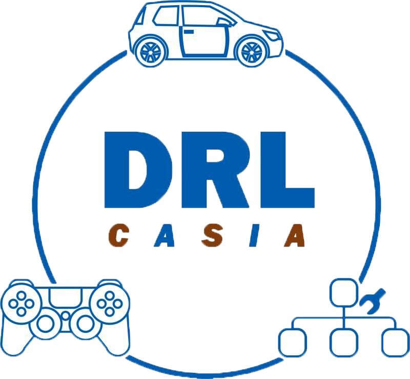

<!-- PROJECT SHIELDS -->

[![Contributors][contributors-shield]][contributors-url]
[![Forks][forks-shield]][forks-url]
[![Stargazers][stars-shield]][stars-url]
[![Issues][issues-shield]][issues-url]
[![MIT License][license-shield]][license-url]
[![LinkedIn][linkedin-shield]][linkedin-url]

<!-- PROJECT LOGO -->
<br />

<p align="center">
  <a href="https://github.com/DRL-CASIA/Planning/">
    
  </a>

  <h3 align="center">中国科学科院自动化研究所--Team Neurons</h3>
  <p align="center">
    Time to start！
    <br />
    <a href="https://github.com/DRL-CASIA/Planning"><strong>Wiki</strong></a>
    <br />
    <br />
    <a href="https://github.com/DRL-CASIA/Planning">查看Demo</a>
    ·
    <a href="https://github.com/DRL-CASIA/Planning/issues">报告Bug</a>
    ·
    <a href="https://github.com/DRL-CASIA/Planning/issues">提出新特性</a>
  </p>

</p>

## 相关工作及成果

[所内报道：深度强化学习团队提出基于深度强化学习的未知环境自主探索方法](http://www.ia.ac.cn/xwzx/kydt/202007/t20200728_5646953.html)

[公众号报道：团队新作 | 基于深度强化学习的未知环境自主探索方法](https://mp.weixin.qq.com/s/E68P5j2chxgenZOiCd0v6g)

发表文献：

 H. Li, Q. Zhang, and D. Zhao. “ Deep reinforcement learning-based automatic exploration for navigation in unknown environment,” IEEE Transactions on Neural Networks and Learning Systems, vol. 31, no. 6, pp. 2064–2076, 2020.  


# 规划模块 
## 目录

- [软件功能介绍](#软件功能介绍)
  - [开发前的配置要求](#开发前的配置要求)
  - [安装步骤](#安装步骤)
- [软件效果展示](#软件效果展示)
- [依赖工具及环境](#依赖工具及环境)
- [编译及安装方式](#编译及安装方式)
- [软硬件系统框图](#软硬件系统框图)
- [原理介绍与理论支持分析](#原理介绍与理论支持分析)
  - [如何参与开源项目](#如何参与开源项目)
- [软件架构与层级图](#软件架构与层级图)
- [开源协议](#开源协议)
- [设计模式](#设计模式)
- [鸣谢](#鸣谢)

### 软件功能介绍
test


###### 开发前的配置要求

1. xxxxx x.x.x
2. xxxxx x.x.x

###### **安装步骤**

1. Get a free API Key at [https://example.com](https://example.com)
2. Clone the repo

```sh
git clone https://github.com/DRL-CASIA/Planning.git
```

### 文件目录说明
eg:

```
filetree 
├── ARCHITECTURE.md
├── LICENSE.txt
├── README.md
├── /account/
├── /bbs/
├── /docs/
│  ├── /rules/
│  │  ├── backend.txt
│  │  └── frontend.txt
├── manage.py
├── /oa/
├── /static/
├── /templates/
├── useless.md
└── /util/

```


### 软件效果展示 


### 依赖工具及环境

暂无

### 编译及安装方式

- [xxxxxxx](https://getbootstrap.com)
- [xxxxxxx](https://jquery.com)
- [xxxxxxx](https://laravel.com)

### 软硬件系统框图


#### 原理介绍与理论支持分析

贡献使开源社区成为一个学习、激励和创造的绝佳场所。你所作的任何贡献都是**非常感谢**的。


1. Fork the Project
2. Create your Feature Branch (`git checkout -b feature/AmazingFeature`)
3. Commit your Changes (`git commit -m 'Add some AmazingFeature'`)
4. Push to the Branch (`git push origin feature/AmazingFeature`)
5. Open a Pull Request


### 软件架构与层级图

该项目使用Git进行版本管理。您可以在repository参看当前可用版本。

### 开源协议

该项目签署了MIT 授权许可，详情请参阅 [LICENSE.txt](https://github.com/DRL-CASIA/Planning/blob/master/LICENSE.txt)

### 设计模式

### 鸣谢


<!-- - [GitHub Emoji Cheat Sheet](https://www.webpagefx.com/tools/emoji-cheat-sheet)
- [Img Shields](https://shields.io)
- [Choose an Open Source License](https://choosealicense.com)
- [GitHub Pages](https://pages.github.com)
- [Animate.css](https://daneden.github.io/animate.css)
- [xxxxxxxxxxxxxx](https://connoratherton.com/loaders) -->

<!-- links -->
[your-project-path]:DRL-CASIA/Planning
[contributors-shield]: https://img.shields.io/github/contributors/DRL-CASIA/Planning.svg?style=flat-square
[contributors-url]: https://github.com/DRL-CASIA/Planning/graphs/contributors
[forks-shield]: https://img.shields.io/github/forks/DRL-CASIA/Planning.svg?style=flat-square
[forks-url]: https://github.com/DRL-CASIA/Planning/network/members
[stars-shield]: https://img.shields.io/github/stars/DRL-CASIA/Planning.svg?style=flat-square
[stars-url]: https://github.com/DRL-CASIA/Planning/stargazers
[issues-shield]: https://img.shields.io/github/issues/DRL-CASIA/Planning.svg?style=flat-square
[issues-url]: https://img.shields.io/github/issues/DRL-CASIA/Planning.svg
[license-shield]: https://img.shields.io/github/license/DRL-CASIA/Planning.svg?style=flat-square
[license-url]: https://github.com/DRL-CASIA/Planning/blob/master/LICENSE
[linkedin-shield]: https://img.shields.io/badge/-LinkedIn-black.svg?style=flat-square&logo=linkedin&colorB=555
[linkedin-url]: https://linkedin.com/in/zhentaotang


